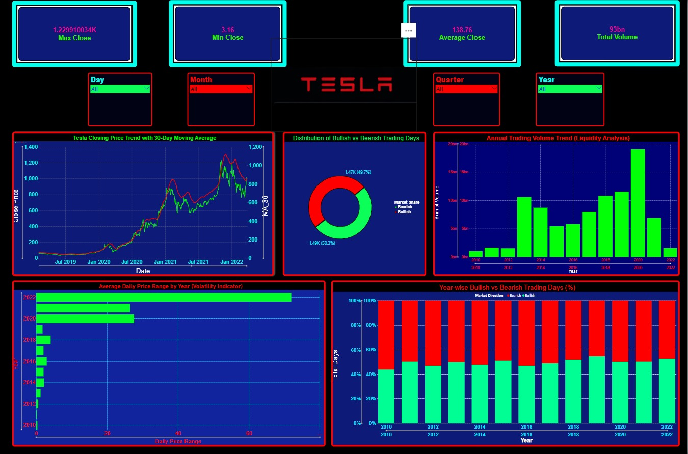
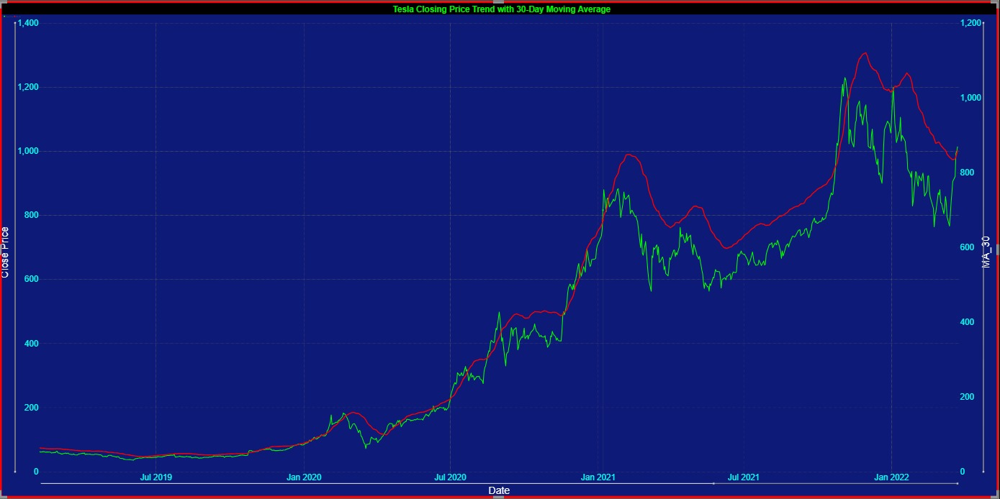
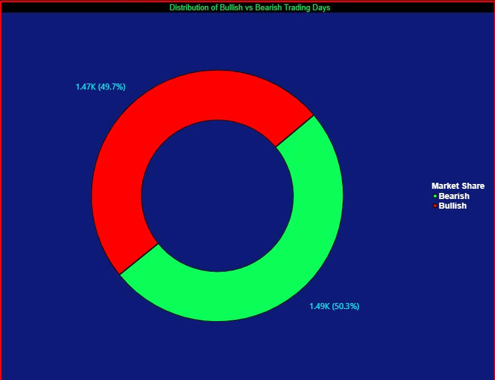
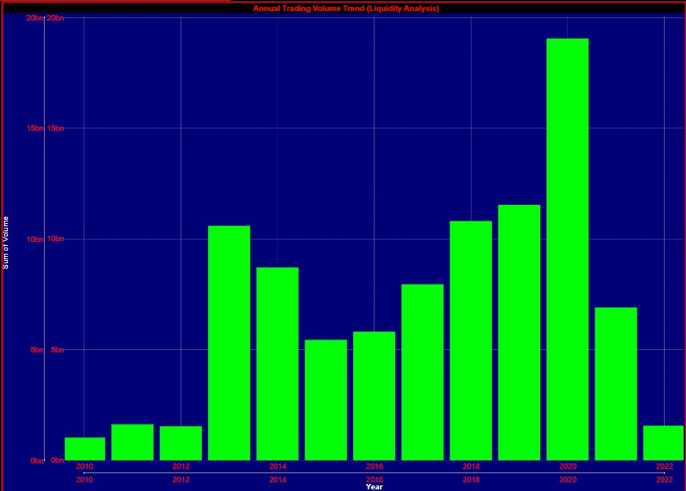
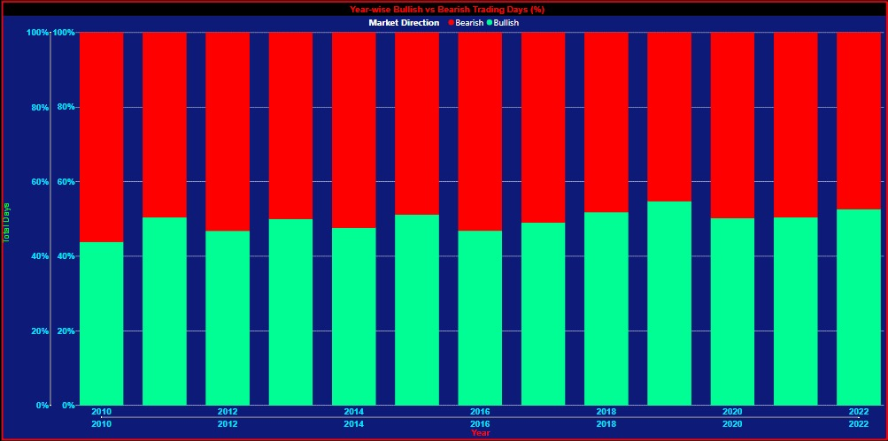

# Tesla Stock Analysis Dashboard 📈

An interactive Power BI dashboard built to analyze Tesla (TSLA) stock performance using historical market data from 2010–2022.

This project demonstrates data cleaning, financial analytics, KPI reporting, market sentiment analysis, trading volume analysis, volatility measurement, and dashboard design using Power BI and DAX.

---

## Dashboard Preview

---

## Project Objectives

- Analyze Tesla's historical stock performance.
- Identify long-term growth trends.
- Evaluate market sentiment through bullish and bearish trading days.
- Measure stock volatility and trading activity.
- Develop an interactive Power BI dashboard for financial analytics.

---

## Key Performance Indicators

| KPI | Value |
|-------|-------|
| Maximum Closing Price | $1,229 |
| Minimum Closing Price | $3.16 |
| Average Closing Price | $138.76 |
| Total Trading Volume | 93 Billion |

---

## Dashboard Features

### Tesla Closing Price Trend with 30-Day Moving Average

The moving average smooths short-term fluctuations and highlights long-term trends.

---

### Distribution of Bullish vs Bearish Trading Days

Shows overall market sentiment by classifying each trading day based on price movement.

---

### Annual Trading Volume Trend

Analyzes market liquidity and investor participation over time.

---

### Volatility Analysis

Measures average daily price range to identify periods of higher market risk.

---

## Technologies Used

- Power BI
- DAX
- Power Query
- Microsoft Excel
- Data Visualization
- Financial Analytics

---

## Dataset Fields

- Date
- Open
- High
- Low
- Close
- Volume
- Moving Average (MA30)
- Market Direction
- Daily Price Range

---

## Key Insights

- Tesla experienced rapid growth after 2019.
- Trading volume peaked during major expansion periods.
- Bullish and bearish trading days remained nearly balanced.
- Volatility increased significantly during high-growth years.
- Moving averages effectively highlighted long-term trends.

---

## Repository Contents

| File | Description |
|--------|------------|
| README.md | Project overview |
| HSTW_Project_3.pdf | Complete project report |
| tesla_stock_analysis_report.html | Interactive portfolio version |
| TSLA_Cleaned.csv | Cleaned dataset |
| screenshots/ | Dashboard and chart images |

---

## Future Enhancements

- Real-time stock data integration
- Predictive price forecasting
- RSI indicator analysis
- MACD analysis
- Bollinger Bands visualization
- Live dashboard deployment

---

## Author

### Saksham Chopra

Computer Science Undergraduate

GitHub Profile:
https://github.com/sunbreather99

Repository:
https://github.com/sunbreather99/Tesla-Stock-Analysis-PowerBI

---
